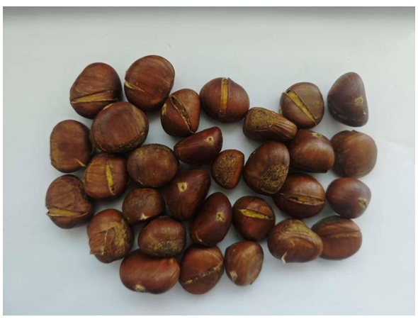
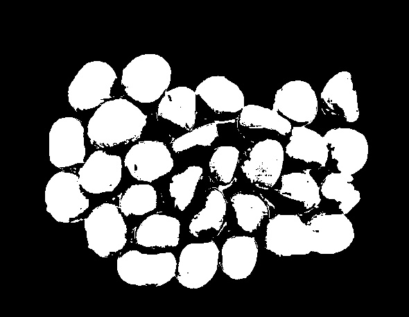
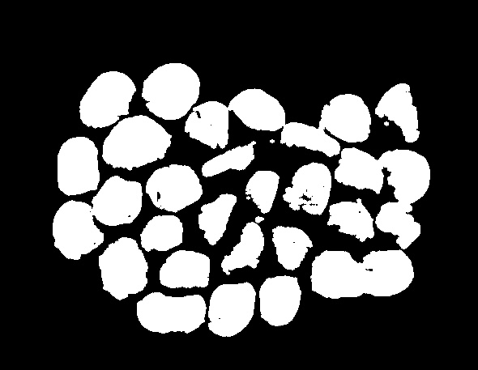
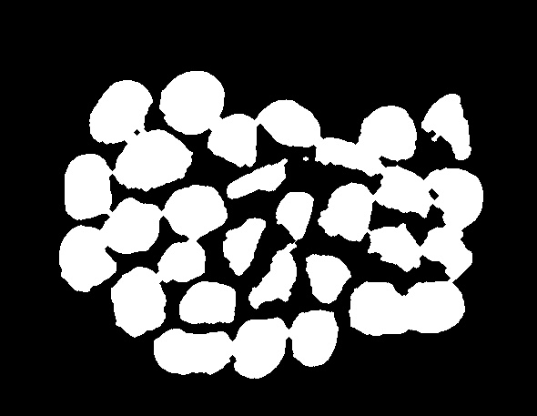
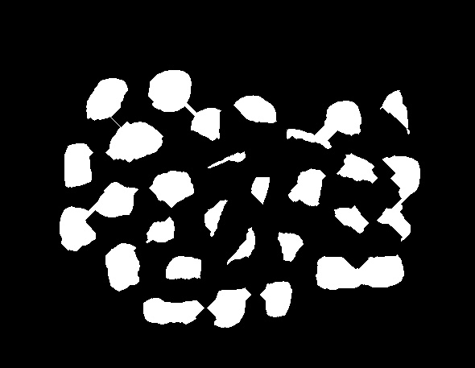
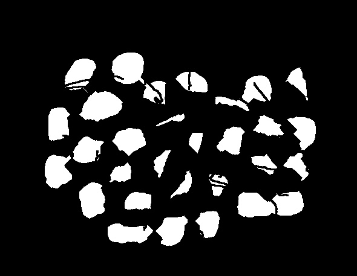
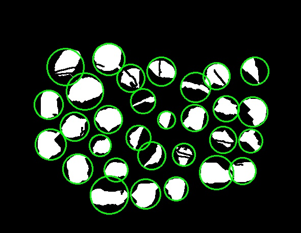
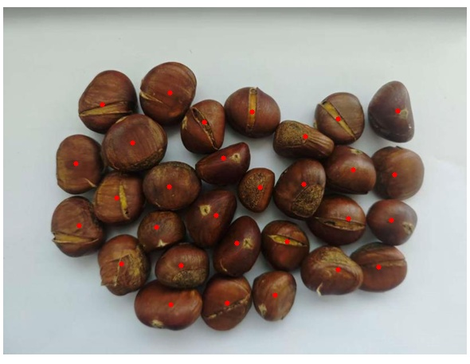

# 基于图像识别的糖炒栗子自动计数系统

## 项目简介

本项目实现了一个基于传统图像处理技术的糖炒栗子自动计数系统。系统能够处理RGB格式的糖炒栗子俯视图像，准确统计图像中的栗子数量，并分析每个栗子所占的像素面积。通过HSV颜色空间分割、形态学操作和边缘检测等技术，有效解决了栗子表面反光、粘连和尺度变化等挑战。

## 系统特性

- ✅ 准确计数糖炒栗子数量（误差控制在±5%以内）
- ✅ 统计每个栗子的像素面积
- ✅ 处理部分粘连和光照不均情况
- ✅ 基于传统图像处理方法，无需深度学习模型
- ✅ 完整的可视化中间结果

## 技术架构

### 核心处理流程

1. **图像预处理**
   - HSV颜色空间转换与褐色区域提取
   - CLAHE对比度增强
   - 高斯模糊去噪

2. **特征提取**
   - Canny边缘检测
   - 形态学操作序列（开运算→闭运算→腐蚀）
   - 边缘信息融合

3. **目标检测与优化**
   - 轮廓查找与最小外接圆拟合
   - 圆重叠检测与合并（极大值抑制）
   - 半径过滤与噪声去除

4. **结果输出**
   - 可视化检测结果
   - 统计信息输出

## 环境要求

### 硬件环境
- 处理器：Intel Core i5 或同等性能以上
- 内存：8GB 或以上
- 存储空间：至少500MB可用空间

### 软件环境
- 操作系统：Windows 10/11, macOS, 或 Linux
- Python 3.8+
- 主要依赖库：
  - OpenCV 4.5+
  - NumPy 1.21+

## 项目结构

```
学号_姓名/
├── code/                           # 源代码目录
│   ├── main.py                     # 主程序入口
│   ├── utils.py                    # 工具函数库
│   └── requirement.txt             # 依赖环境配置
├── imgs/                           # 图像资源目录
│   ├── 1_original.jpg              # 原始图像
│   ├── 2_brown_mask.jpg            # 褐色掩膜
│   ├── 3_Canny.jpg                 # 边缘检测结果
│   ├── 4_masked_edge.jpg           # 边缘叠加结果
│   ├── 5_opened.jpg                # 开运算结果
│   ├── 6_closed.jpg                # 闭运算结果
│   ├── 8_eroded.jpg                # 腐蚀结果
│   ├── 9_circle.jpg                # 圆检测可视化
│   └── 10_final.jpg                # 最终结果
├── 实验报告.docx                   # Word版本实验报告
└── 实验报告.pdf                    # PDF版本实验报告
```

## 安装与使用

### 安装依赖

```bash
pip install -r code/requirement.txt
```

### 运行系统

```bash
cd code
python main.py
```

## 处理效果展示

### 原始图像


### 褐色区域提取


### 边缘检测


### 形态学处理
| 开运算 | 闭运算 | 腐蚀操作 |
|--------|--------|----------|
|  |  |  |

### 边缘融合


### 检测结果



## 核心算法

### HSV颜色空间提取
```python
hsv = cv2.cvtColor(img, cv2.COLOR_BGR2HSV)
brown_mask = cv2.inRange(hsv, (0, 43, 52), (255, 255, 255))
```

### 形态学操作序列
```python
# 开运算去除噪声
opened = cv2.morphologyEx(brown_mask, cv2.MORPH_OPEN, open_kernel, iterations=1)

# 闭运算填充内部空洞  
closed = cv2.morphologyEx(opened, cv2.MORPH_CLOSE, close_kernel, iterations=3)

# 腐蚀分离粘连栗子
eroded = cv2.erode(closed, erode_kernel, iterations=9)
```

### 圆重叠合并算法
```python
def merge_circles(circles):
    """基于重叠面积的圆合并算法"""
    # 实现重叠检测与合并逻辑
    # 重叠率阈值：30%
```

## 性能指标

- **计数准确率**：误差控制在±5%以内
- **处理速度**：单张图像处理时间<2秒
- **鲁棒性**：能够处理光照不均和部分粘连情况

## 系统限制

1. **背景要求**：在非白色背景环境下效果较差
2. **光照条件**：最优检测环境为面光源，强反光会影响效果
3. **粘连程度**：严重粘连的栗子可能无法完全分离

## 开发历程

本项目经历了四个主要的技术迭代阶段：

1. **版本1**：基于灰度图像的传统方法（霍夫圆检测）
2. **版本2**：基于HSV颜色空间的方法（颜色分割+轮廓查找）  
3. **版本3**：结合边缘检测的改进方法（强制分离粘连）
4. **版本4**：综合优化方案（最终版本）

## 实验心得

通过本项目，深入掌握了传统图像处理技术的实际应用，包括：
- HSV颜色空间在特定物体识别中的优势
- 形态学操作序列的设计与调优
- 多特征融合的策略设计
- 算法参数的经验调优方法

## 作者信息

- **姓名**：吴尧承
- **学号**：2304120130
- **班级**：智能建造一班
- **指导老师**：张苗苗、孟庆祥
- **课程**：数字图像与处理

## 许可证

本项目仅用于学术研究目的。